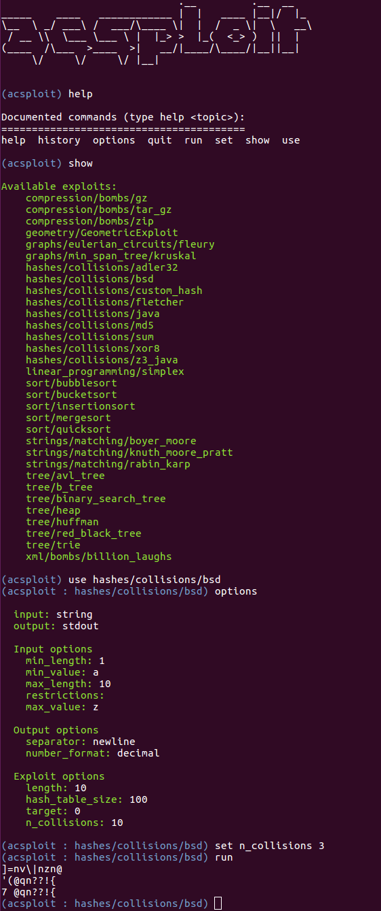

ACsploit: a tool for generating worst-case inputs for algorithms
=======================================================================

ACsploit is an interactive command-line utility to generate worst-case inputs to commonly used algorithms. These
worst-case inputs are designed to result in the target program utilizing a large amount of resources (e.g. time or memory).

ACsploit is designed to be easy to contribute to. Future features will include adding arbitrary constraints to inputs, 
creating an API, and hooking into running programs to feed worst-case input directly to functions of interest.

Install
-------

First `git clone` the repo, and then do `pip install -r requirements.txt`.

Usage
-----

Start ACsploit with `python acsploit.py`. From there, you can use the `help` command to see what commands are available.
You can call `help` on any of them to learn more about how to use that command, such as `help set`.

To see the available exploits, use the `show` command. To stage one for use, use `use [exploit_name]`. To see a
description of the exploit, run `info`. At any point, you can run `options` to see the current input, output, and 
exploit options, and then use `set [option_name] [value]` to set an option. To see detailed descriptions of the options,
 use `options describe`.

Tab completion is enabled for exploit and option names.

Finally, use `run` to generate output from the exploit.

ACsploit supports abbreviated commands, bash commands using `!`, `CTRL+R` history search, and more.

#### Command-line Options

`--load-file SCRIPT` runs the commands in `SCRIPT` as if they had been entered in an interactive ACsploit session and then exits. `#` can be used for comments as in Python. 

`--debug` enables debug mode, in which ACsploit prints stack-traces when errors occur.

Warning 
------------------------
Caution should be used in generating and accessing ACsploit exploits. Using unreasonable exploit parameters may cause denial of service on generation. Additionally, the canned exploits (e.g. compression bombs) may cause denial of service if accessed by relevant applications. 

Contributing to ACsploit
------------------------

We welcome community contributions to all aspects of ACsploit! For guidelines on contributing, please see [Contributing](CONTRIBUTING.md)