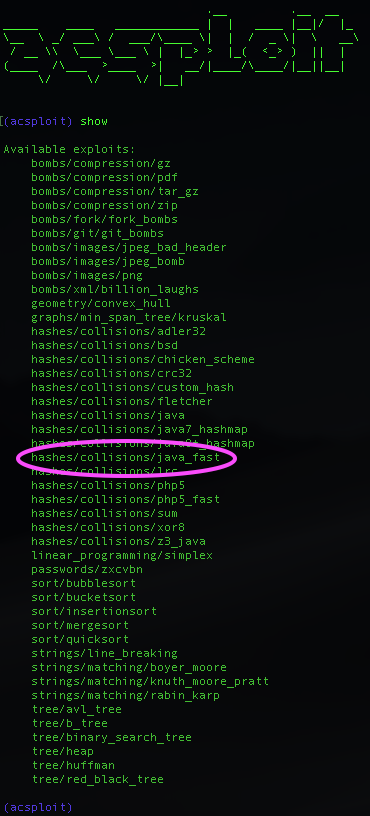
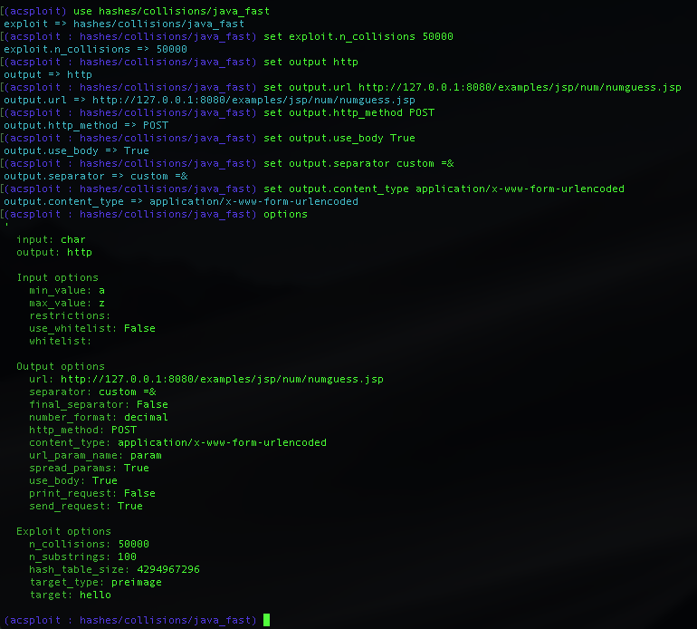
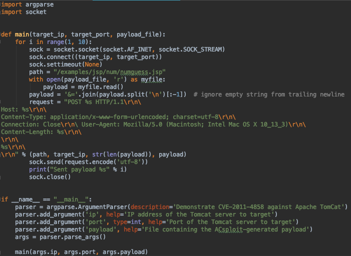
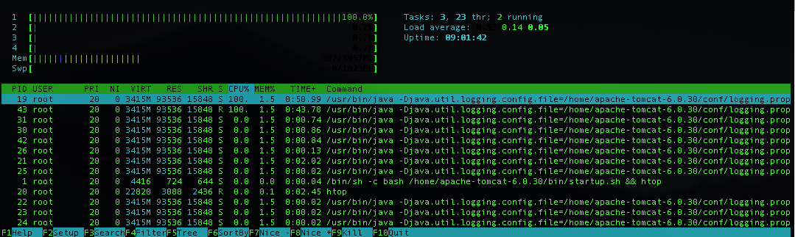

# Exploiting Java Hash Collisions with ACsploit 

## Using ACsploit to create a PoC for CVE-2011-4858

A major design goal of ACsploit was to bridge as much of the gap between vulnerability discovery and exploitation as possible. In this example we build a working exploit for a real-world CVE using ACsploit, based only on a high level description of the vulnerability.

In late 2011 Alexander Klink and Julian Wälde noted algorithmic complexity vulnerabilities in the hash functions of several popular web-based platforms. In short, these platforms utilized hash functions vulnerable to practical pre-image attacks. Among these functions was the default Java hash function. Thus, while their findings led to several CVEs, for our demonstration we have chosen [CVE-2011-4858](https://www.cvedetails.com/cve/CVE-2011-4858/) which targets the Java-based [Apache Tomcat](http://tomcat.apache.org) web server. Apache Tomcat stores variables from `POST` requests in a Java Hash table and so a `POST` request with a large number of variables that have colliding hashes will cause poor runtime behavior and will spike CPU utilization to 100% (efficiently producing a DOS with a relatively small payload).

For this example, we select Tomcat version 6.0.30, but there are several other vulnerable versions as noted in the CVE. We've included a `Dockerfile` in this directory that will start a vulnerable Tomcat 6.0.30 server. To start the server and view its CPU usage in `htop` run the following commands:

```
docker build -t tomcat-CVE-demo .
docker run -it -p 8080:8080 tomcat-CVE-demo
```

From the description given in the CVE we know that our payload will be a malicious `HTTP POST` request. We also know that we want it to contain a list of variables that share the same Java hash value. Let's begin by building a list of colliding Java hash pre-images using ACsploit.

We start ACsploit and examine the available exploits. 



After selecting `hashes/collisions/java` as our module, we set our `options`. We want to generate an `output` file containing the hash collisions, so we set that option first.

We now examine the exploit options and set some necessary parameters. Apache Tomcat accepts `POST` requests of at most 2MB by default, so generating more collisions than will fit in 2MB would be a waste. Empirically, we found that 100,000 collisions sits comfortably between 1 and 2MB in size, so we set `n_collisions` to `100000`. This isn't scientifically optimal, but more than suffices for a proof of concept. (If we wanted to maximize the effect of our exploit we could spend a bit longer optimizing the number of collisions that would fit in 2MB.) We then set the `hash\_table\_size` to `2^32`, as this covers all integer values in Java. (If we knew the hash table was a particular size this option would allow us to adapt our collisions appropriately (e.g. if hashes were reduced modulo 1,000).)

(Note that we leave the `input` generator set to `char`. This may seem unintuitive because the output will be a set of strings, but the exploit generates its collisions by manipulating and combining individual characters, and so must be given individual characters to work with.)


We re-examine our options. Everything looks fine, so we are ready to run our exploit with `run`.



We now have our 100,000 hash collisions. We write the small `python` script shown below to format them appropriately and serve them in a `POST` request. (There's nothing special about Python here, so feel free to use your favorite method to build and serve the `POST` request).



The `path` we supplied leads to a default example page on the Tomcat server that accepts user input to guess a random number. (Any page will do as a target as long as it accepts `POST` requests, and so this one fits the bill.)  The outer `for` loop controls how many times we send the payload. To initiate a serious DOS, an attacker might want to send hundreds or even thousands of payloads, but ten payloads will be sufficient to run up the CPU on all available threads on our target box and serve as a proof of concept.

We are now ready to launch our exploit! We run the script with the invokation below to target the Tomcat Docker container we started above and observe we see that the CPU utilization of all 4 cores is at 100% in `htop`.

```
python CVE-2011-4858-PoC.py 127.0.0.1 8080 collisions.txt
```



