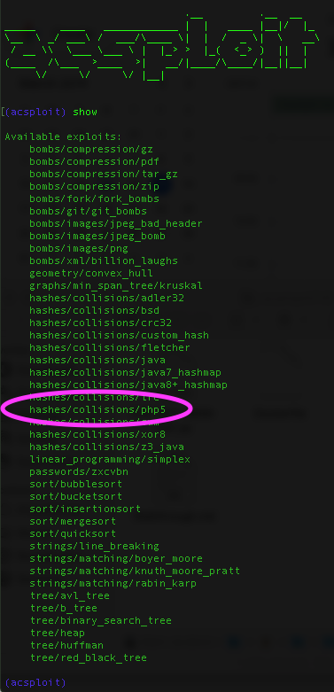
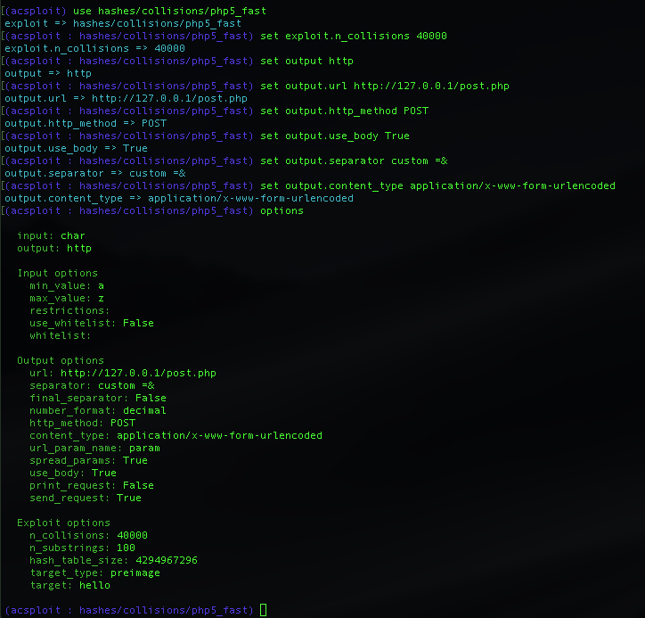
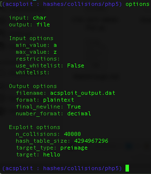
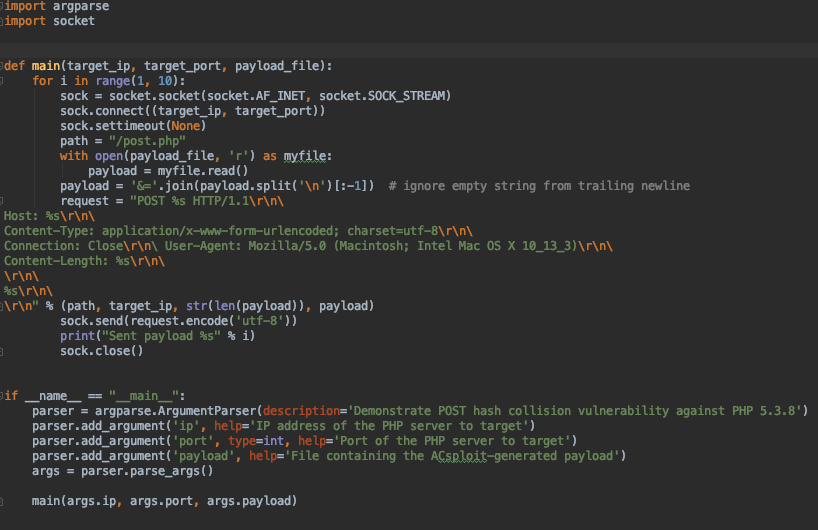
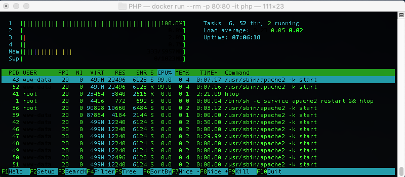

# Exploiting PHP Hash Collisions with ACsploit 

## Using ACsploit to create a PoC for PHP 5

A major design goal of ACsploit was to bridge as much of the gap between vulnerability discovery and exploitation as possible. In this example we build a working exploit for a real-world attack using ACsploit, based only on a high level description of the vulnerability.

In late 2011 Alexander Klink and Julian Wälde noted algorithmic complexity vulnerabilities in the hash functions of several popular web-based platforms. In short, these platforms utilized hash functions vulnerable to practical pre-image attacks. Among these functions was the default PHP hash function. Thus, while their findings led to several CVEs and security patches, for our demonstration we have chosen their attack on the PHP scripting language. PHP stores variables from `POST` requests in a hash table and so a `POST` request with a large number of variables that have colliding hashes will cause poor runtime behavior and will spike CPU utilization to 100% (efficiently producing a DOS with a relatively small payload).

For this example, we select PHP version 5.3.8 running behind Apache 2.2, but any version of PHP 5 below 5.3.8 is vulnerable. (The vulnerability was [patched](http://svn.php.net/viewvc?view=revision&revision=321040) in PHP 5.3.9.) We've included a `Dockerfile` in this directory that will start a vulnerable PHP 5.3.8 instance. To start the server and view its CPU usage in `htop` run the following commands:

```
docker build -t php538 .
docker run -it -p 80:80 php538
```

From the description given in the CVE we know that our payload will be a malicious `HTTP POST` request. We also know that we want it to contain a list of variables that share the same PHP hash value. Let's begin by building a list of colliding PHP hash pre-images using ACsploit.

We start ACsploit and examine the available exploits. 



After selecting `hashes/collisions/php5` as our module, we set our `options`. We want to generate an `output` file containing the hash collisions, so we set that option first.

We now examine the exploit options and set some necessary parameters. We want 100,000 collisions as a baseline to start with to achieve some measurable effect so we set `n_collisions` to `40000`. This may not achieve 100% CPU but it more than suffices for a proof of concept. (Once we know that we can achieve an effect we can go back an increase the number of collisions.) We note that the `hash\_table\_size` is already set to `2^32`, which covers all integer values in PHP. (If we knew the hash table was a particular size this option would allow us to adapt our collisions appropriately (e.g. if hashes were reduced modulo 1,000).)

(Note that we leave the `input` generator set to `char`. This may seem unintuitive because the output will be a set of strings, but the exploit generates its collisions by manipulating and combining individual characters, and so must be given individual characters to work with.)



We re-examine our options. Everything looks fine, so we are ready to run our exploit with `run`. (Note that generating 40,000 collisions may take quite some time, on the order of 10-20 minutes. You can reduce the number of hashes at the cost of less of a CPU impact on the target.)



We now have our 40,000 hash collisions. We write the small `python` script shown below to format them appropriately and serve them in a `POST` request. (There's nothing special about Python here, so feel free to use your favorite method to build and serve the `POST` request).



The `path` we supplied leads to a simple PHP file the `Dockerfile` placed on the PHP server that accepts `POST` requests. (What the page does is irrelevant as long as it accepts `POST` requests.)  The outer `for` loop controls how many times we send the payload. To initiate a serious DOS, an attacker might want to send hundreds or even thousands of payloads, but ten payloads will be sufficient to run up the CPU on all available threads on our target box and serve as a proof of concept.

We are now ready to launch our exploit! We run the script with the invokation below to target the our PHP Docker container and observe the CPU utilization of all 4 cores spike in `htop`. If we increased the number of collisions beyond 40,000 the CPU usage would increase accordingly.

```
python PoC.py 127.0.0.1 80 acsploit_output.dat
```



