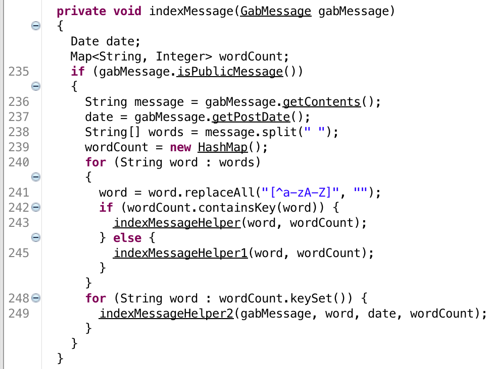
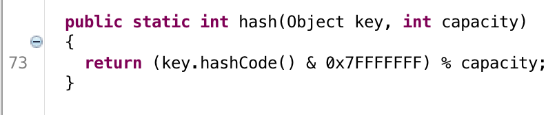

# ACsploit in STAC: Gabfeed


ACsploit was originally developed to assist in solving DARPA STAC (Space/Time Analysis for Cybersecurity) challenge problems. STAC problems either address side-channels or algorithmic complexity vulnerabilities (i.e. achieve a large runtime/disk/memory utilization). Each STAC problem has a limited attacker input budget, and conditions defining how the vulnerability must be triggered. Below is the challenge question for the program "gabfeed_2" from STAC engagement 2.

## gabfeed_2

```
Challenge Program:

gabfeed_2.jar

Challenge Question:

Is there an algorithmic complexity vulnerability in time that would cause the challenge
program's real runtime (on the reference platform) to exceed the resource usage limit
given the input budget?

Additional background for question:

GabFeed is a web based application that supports multiple users, however, this question assumes
there is only one user interacting with the system in any vulnerability demonstration.

Input Budget:

Maximum sum of the PDU sizes of the HTTP requests sent from the user to the server: 400000 bytes

Resource Usage Limit:

Runtime: 150 seconds measured as the time interval between sending the last byte of the attack and
the server sending the last byte of the response.
```

Let's begin by pulling down the challenge program, contained in gabfeed_2.tar. In the un-tarred directory, we can see the program description in `description.txt`, the challenge program executable and other configuration files in `/challenge_program` and scripts that will help us interact with the challenge program in `/examples`. The server can be started with the `/challenge_program/start.sh` script. Be sure to remove `/challenge_program/data/gabfeed.db` between runs to start with a fresh installation each time.

We can take a look at the decompiled source code by using JD-Gui or similar Java decompiler and examining `/challenge_program/lib/gabfeed_2.jar`. In `GabDatabase.class`, we see that entries of the internal database are stored in custom hash maps. Furthermore, when a user sends a message, that message is broken up into individual words with each word added to a hash map. 



Investigating the custom hash implementation, we see that the entries are hashed using the default Java hash code function.



What's more, the hash map implements each bin as an unbalanced binary search tree. We may be able to trigger an algorithmic complexity vulnerability that satisfies the challenge question if we generate a long message full of words that share a common Java hash value, and pass them in sorted order to produce a degenerate binary search tree.

## Java's hash code

Java's hash code was never intended to be a secure hash, but rather to be an efficient procedure that produces reasonable distributions of hashes. While any insecure hash should reasonably expect collisions, Java's hash code is susceptible to a meet-in-the-middle attack which can efficiently generate large lists of collisions. The default Java hash code function description is shown below. 


Can you spot the flaw? The java hash of a string A+B can be efficiently computed knowing just the hashes of A and B separately. Indeed, the hash of A+B is hash(A)*31^(len(B)) +hash(B). Let's say we want to generate hash collisions hashing to a particular value, we can achieve this by generating a list of hashes for short strings (brute forceable), and then combining them to generate collisions. 

##ACsploiting to victory

When our team first solved this challenge question, we developed our own scripts to generate hash collisions. Today, we can do it easily with ACsploit. Let's take advantage of ACsploit's `--load-file` feature, which allows a user to load commands from a file. We'll put the following commands into a text file `commands.txt`.

```
use hashes/collisions/java
set output file
set output.filename collisions.txt
set exploit.n_collisions 30000
set exploit.hash_table_size 4294967296
run
```
The first command notifies ACsploit to use the `hashes/collisions/java module`, which generates Java hash collisions. The following two lines change the output generator to output to a file called `collisions.txt`. Next, the exploit options are set: we want 30,000 collisions, and the hash table is of size 2^32= 4294967296, the size of a Java int. Finally, we command ACsploit to run the exploit.

We can run ACsploit using this command script as follows:

```
python acsploit.py --load-file commands.txt

```

After a short time, we get the notification that our script has completed successfully.


In the event of a collision, the challenge program stores values in a binary search tree. In order to produce the worst-case behavior, we want to create a degenerate binary tree. A simple way to do this is to sort the inserted values. We also want the collisions to be space delimited (custom delimiters are soon to come in ACSploit).

```
sort collisions.txt | tr '\r\n' ' ' > sorted_collisions.txt
```

After sorting our hash collisions, we can serve them directly to the running challenge program using the example login script that was provided. First move `sorted_collisions.txt` into the `/examples` directory of gabfeed_2, and run the following script (with the target ip replaced by wherever you are running the server).


```
./login.sh foo df89gy9Qw
curl -s -b cookies.txt -F messageContents=@sorted_collisions.txt  --insecure https://[target-ip]:8080/newmessage/1_0
curl -s -L -b cookies.txt --insecure https://[target-ip]:8080/thread/1_0?suppressTimestamp=true
```

Running this bash script, we see the challenge program shoot to 100 percent CPU utilization.


Success! After 150 seconds, we verify that we satisfy the conditions of the challenge question. Our sorted collision file consists of 328,645 bytes. Even with the overhead for the login script and the curl requests, we are still well under the 400,000 byte input budget.

# 2-for-1

The same exploit also satisfies a similar challenge question for gabfeed_4, another STAC problem. Value!

