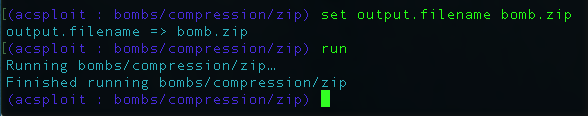

# Bombing TextCrunchr1

## Using ACsploit to identify and exploit vulnerabilities

`TextCrunchr1` is a program from Engagement 2 of the DARPA STAC program. (The STAC program, which birthed ACsploit, presents its performers with a series of Java programs containing algorithmic complexity vulnerabilities and challenge questions that specify the conditions under which the vulnerabilities must be exploited.) In this example we use ACsploit to identify and exploit a vulnerability.

The `textcrunchr1.tar` archive in this directory, contains a description of the challenge program (`description.txt`), the challenge program itself(`challenge_program/bin/textcrunchrhost_1`) as well as some example scripts to help a user interact with the vulnerable program (`examples/`). You can use these to follow along with this walkthrough at home.

The challenge question (`Question_021.txt`) that we are trying to answer is reproduced below:

```
Challenge Program:

    textcrunchr_1.jar

Challenge Question:

    Is there an algorithmic complexity vulnerability in time that would cause the challenge
    program's real runtime (on the reference platform) to exceed the resource usage limit
    given the input budget?

Additional background for question:

    None

Input Budget:

    Total size of input file (or files): 400000 bytes
    
Resource Usage Limit
    
    Runtime: 300 seconds
```

From this that we are looking for a runtime algorithmic complexity vulnerability in time in the challenge program. 

The following line in `description.txt` stands out as a good place to start our investigation of the program:

```
Given a zip, bz2, or tar file that contains text files, TextCrunchr will analyze each file.
```

Since the challenge program accepts compressed files, it's possible a conventional compression bomb will trigger the AC vulnerability.

Let's start by firing up ACsploit and examining the potential exploits.


We see exploits for generating `zip`, `gz`, and `tar.gz` bombs. Let's use the `zip` bomb generator.


From the exploit option descriptions we see that ACsploit can generate three different types of zip bombs: recursive bombs, single layer bombs, and layered zip bombs. Let's try out the recursive zip bomb first, naming the file `bomb.zip`.



Checking the generated zip bomb, we see that `bomb.zip` is only 400 bytes, well within out input budget of 400,000 bytes. Now that we've generated our bomb, let's try it out! We move `bomb.zip` into the `examples/` directory and edit `example_basic.sh` as shown below to throw the bomb at `TextCrunchr1`.

```
$ cat example_basic.sh
#!/bin/sh
../challenge_program/bin/textcrunchrhost_1 ./bomb.zip
```
When we run this modified example script, we see that it takes a little while to return. Will we hit 300 seconds? Checking `htop`, we see that the Java process for `TextCrunchr1` is at 100% CPU utilization, a good sign that we've found a vulnerability. After 5 minutes, the process is still running at 100% CPU utilization and we can confirm that the recursive zip bomb achieved the desired AC vulnerability.


